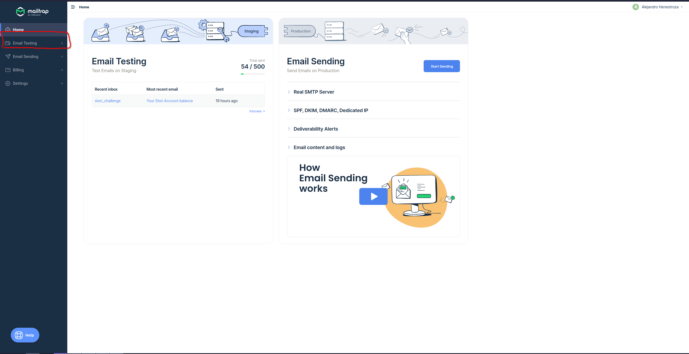
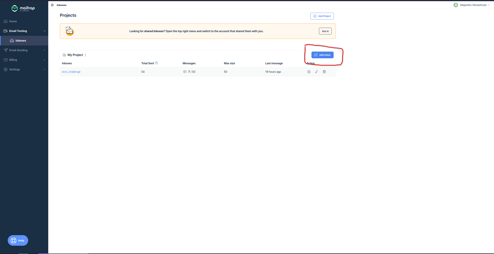
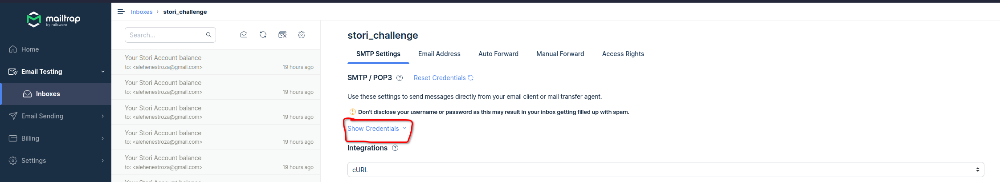
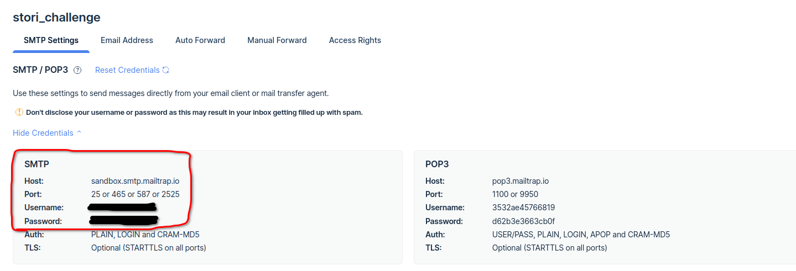

# Setup Mailtrap as SMTP

If you want to use Mailtrap for email testing, you can follow these instructions:

1. Go to [https://mailtrap.io/](https://mailtrap.io/) and create a free account.
2. Login to your account.
3. You will see the following page. Go to "Email testing" > "Inboxes"
   
4. Create a new Inbox
   
5. On your new Inbox, click on "Show Credentials"
   
6. Copy the Host, Port, Username and Password
   
7. On your .env file, complete the `SMTP_HOST`, `SMTP_PORT`, `SMTP_USERNAME` and `SMTP_PASSWORD` with the values you copied. The `SMTP_SENDER` can be any value.
